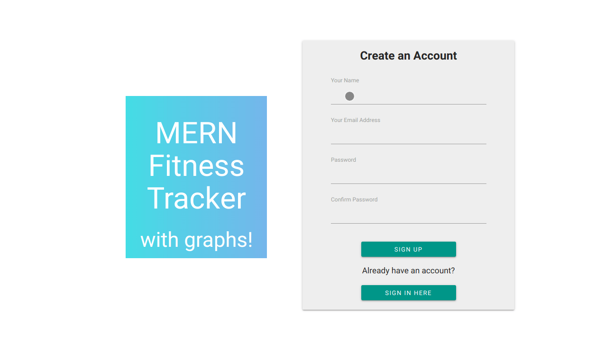

# MERN Stack Fitness Tracker

## Description

## Demo
If you don't want to deploy this to demo it (understandably), here is a quick collection of demo gifs to show off some of the features.

#### Navigation Demo

#### Register
The app features a registration/login page. I am using JWT with passport for authentication, and storing it all in mongo.

#### Server Side Validation
Validation functions can be found in the validation folder in the root. All inputs are validated server side.

#### Progress Logging
Logging progress on a specific exercise is really easy. Graphs are updated in real time with your progress.

#### Mobile Friendly Layout
UI is designed to be clean and usable on any size of device.

## Deployment
